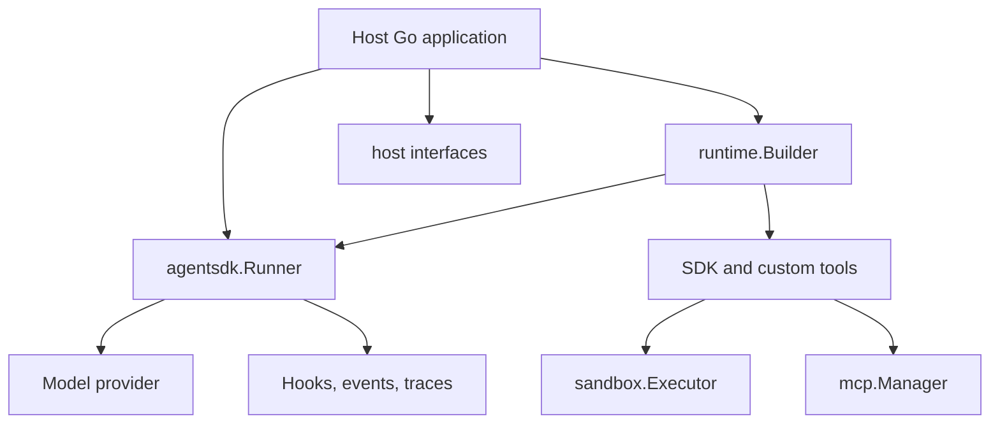

# Architecture

Grateful Agents SDK is a Go runtime library. The host application owns
credentials, persistence, UI, approvals, deployment, and application-specific
tools. The SDK owns reusable agent-loop mechanics, provider adapters, built-in
tools, guardrails, tracing hooks, MCP integration, and subprocess boundaries.

## Runtime Shape



## Package Boundaries

- `pkg/agentsdk`: public runtime API, aliases, conversation helpers, session helpers, guardrails, specialists, progress, tracing, and event helpers.
- `internal/agent`: core runner implementation. Public callers should use `pkg/agentsdk`.
- `pkg/agentsdk/providers`: provider factory and provider-facing public packages.
- `pkg/agentsdk/providers/openai`: OpenAI-compatible provider, API-key and Codex OAuth auth helpers, metadata helpers, compaction helpers, and cost helpers.
- `pkg/agentsdk/providers/anthropic`: Anthropic provider and helpers for API-key and OAuth bearer-token auth.
- `internal/openai` and `internal/anthropic`: provider implementation details.
- `pkg/agentsdk/tools`: default tool registry plus built-in tool packages.
- `pkg/agentsdk/mcp`: `.mcp.json` loading, stdio manager, MCP tool/resource wrapping, result formatting, and break-glass helpers.
- `pkg/agentsdk/sandbox`: subprocess executor abstraction, local executor, Bubblewrap executor, environment handling, and permission-mode enforcement.
- `pkg/agentsdk/runtime`: bundle builder that assembles providers, runner, tools, agent, hooks, guardrails, compaction, and run config.
- `pkg/agentsdk/host`: interfaces for application integration.
- `pkg/agentsdk/host/fileconfig`: file-backed mode and role config.
- `pkg/agentsdk/tracestore`: filesystem trace persistence.
- `pkg/agentsdk/otel`: OpenTelemetry bridge.
- `pkg/agentsdk/memory`: memory store and embedding helpers.
- `pkg/agentsdk/projectstate`: durable event-sourced project state with typed tasks and typed long-term memories. Memory recall is lexical by default and hybrid (lexical + embedding cosine similarity) when an `Embedder` is configured.
- `pkg/agentsdk/tools/projectstate`: agent-facing tools over a `projectstate.Store` (`task_*`, `memory_remember`, `memory_recall`, `memory_list`, `memory_update`, `memory_delete`, `memory_stats`, `prime_context`). See [Project State Tools](projectstate-tools.md) for enablement and usage examples.
- `cmd/grateful-agent-run`: CLI and evaluation harness.
- `examples`: focused runnable examples.
- `test/integration`: live integration suites.
- `eval/audit-fixtures`: security regression corpora.

## Run Flow

1. Build or select a `ModelProvider`.
2. Construct an `agentsdk.Runner`.
3. Assemble tools: built-ins, MCP tools, signal tools, and host-specific tools.
4. Create an `agentsdk.Agent` and `agentsdk.RunConfig`.
5. Call `Runner.Run` or `Runner.RunStreamed`.
6. Observe the run through hooks, event streams, traces, progress snapshots, and returned `RunResult`.

## Prompt Cache Stability

The runner keeps each model request prompt-cache friendly:

- **Stable prefix.** Instructions (agent instructions + `AdditionalInstructions` +
  output schema + MCP context) and the tool list are byte-stable across turns of a
  run. Dynamic per-turn content must never be added to instructions; the only
  sanctioned exception is the no-tool final-summary directive on the last turn.
- **Append-only history.** Conversation items are only appended within a turn loop;
  past items are never edited or reordered. Compaction (which rewrites history) is
  the explicit, observable exception and is recorded via `CompactionRecorder`.
- **Transient tail content.** Per-turn dynamic context (e.g. `PlanRecitation`)
  is appended as the final input item of a single request and regenerated each
  turn rather than persisted, so it never perturbs earlier cached spans.

Hosts using `Agent.InstructionsFn` should return a stable string for the duration
of a run, or accept the cache cost of changing it.

## Host Integration

The reusable runtime depends on narrow interfaces instead of prescribing an
application shape:

- `SessionStore`: load messages, append run items, and persist working state.
- `RunStatusSink`: publish progress, trace IDs, and final status.
- `ConfigSource`: provide permission mode, mode snapshot, guardrails, role catalog, MCP config, and phase directives.
- `TraceStore`: allocate trace directories, append trace records, write files, and finalize traces.
- `ApprovalGate`: decide tool and MCP break-glass approvals.
- Tool factory hooks: inject application-specific tools into the SDK tool set.

## Import Policy

Reusable SDK packages must not depend on application packages. Keep application
integration at the edges (`pkg/agentsdk/host`, `pkg/agentsdk/runtime`, examples,
tests, and `cmd/grateful-agent-run`).

Run:

```sh
make verify-sdk-purity
```

## Dependency Policy

The repository uses Go modules with pinned versions in `go.mod`/`go.sum`.
After dependency changes:

```sh
go mod tidy
```
